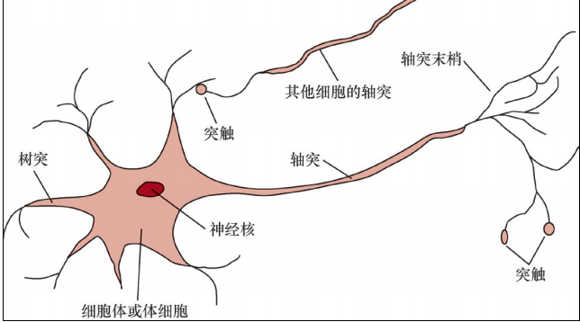
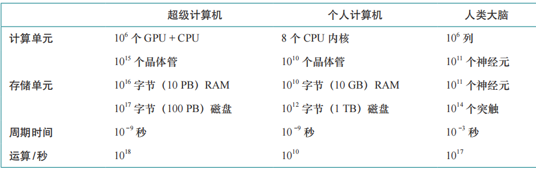

# 绪论

## 1.1 什么是人工智能

> 我们声称人工智能很有趣，但是我们还没有描述它是什么。历史上研究人员研究过几种
不同版本的人工智能。有些根据对人类行为的复刻来定义智能，而另一些更喜欢用“理性”
（rationality）来抽象正式地定义智能，直观上的理解是做“正确的事情”。智能主题的本身也各不相同：一些人将智能视为内部思维过程和推理的属性，而另一些人则关注智能的外部特征，也就是智能行为。从人与理性 b 以及思想与行为这两个维度来看，有 4 种可能的组合，而且这 4 种组合都有其追随者和相应的研究项目。他们所使用的方法必然是不同的：追求类人智能必须在某种程度上是与心理学相关的经验科学，包括对真实人类行为和思维过程的观察和假设；而理性主义方法涉及数学和工程的结合，并与统计学、控制理论和经济学相联系。各个研究团体既互相轻视又互相帮助。

### 1.1.1 类人行为:图灵测试方法

> 图灵测试（Turing test）是由艾伦·图灵（Alan Turing）提出的（Turing, 1950），它被设计成一个思维实验，用以回避“机器能思考吗？”这个哲学上模糊的问题。如果人类提问者在提出一些书面问题后无法分辨书面回答是来自人还是来自计算机，那么计算机就能通过测试。目前，为计算机编程使其能够通过严格的应用测试尚有大量工作要做。计算机需要具备下列能力：

>> * 自然语言处理（natural language processing），以使用人类语言成功地交流；

>> * 知识表示（knowledge representation），以存储它所知道或听到的内容；

>> * 自动推理（automated reasoning），以回答问题并得出新的结论；

>> *机器学习（machine learning），以适应新的环境，并检测和推断模式。

> 图灵认为，没有必要对人进行物理模拟来证明智能。然而，其他研究人员提出了完全图灵
测试（total Turing test），该测试需要与真实世界中的对象和人进行交互。为了通过完全图灵测试，机器人还需要具备下列能力：

>> * 计算机视觉（computer vision）和语音识别功能，以感知世界；

>> * 机器人学（robotics），以操纵对象并行动。

> 以上 6 个学科构成了人工智能的大部分内容。然而，人工智能研究人员很少把精力用在通
过图灵测试上，他们认为研究智能的基本原理更为重要。当工程师和发明家停止模仿鸟类，转而使用风洞并学习空气动力学时，对“人工飞行”的探索取得了成功。航空工程学著作并未将其领域的目标定义为制造“能像鸽子一样飞行，甚至可以骗过其他真鸽子的机器。

### 1.1.2 类人思考:认知建模方法

> 我们必须知道人类是如何思考的，才能说程序像人类一样思考。我们可以通过 3 种方式了
解人类的思维：

>> * 内省（introspection）——试图在自己进行思维活动时捕获思维；

>> * 心理实验（psychological experiment）——观察一个人的行为；

>> * 大脑成像（brain imaging）——观察大脑的活动。

> 一旦我们有了足够精确的心智理论，就有可能把这个理论表达为计算机程序。如果程序的输入/输出行为与相应的人类行为相匹配，那就表明程序的某些机制也可能在人类中存在。例如，开发通用问题求解器（General Problem Solver，GPS）的艾伦·纽厄尔（Alan Newell）和赫伯特·西蒙（Herbert Simon）并不仅仅满足于让他们的程序正确地求解问题，他们更关心的是将推理步骤的顺序和时机与求解相同问题的人类测试者进行比较（Newell and Simon, 1961）。认知科学（cognitive science）这一跨学科领域汇集了人工智能的计算机模型和心理学的实验技术，用以构建精确且可测试的人类心智理论。

> 认知科学本身是一个引人入胜的领域，值得多本教科书和至少一部百科全书（Wilson and Keil, 1999）来介绍。我们会偶尔评论人工智能技术和人类认知之间的异同，但真正的认知科学必须建立在对人类或动物实验研究的基础上。这里，我们假设读者只有一台可以做实验的计算机，因此我们将把这方面的内容留给其他书籍。在人工智能发展的早期，这两种方法经常会混淆。有作者认为，如果算法在某个任务中表现良好，就会是建模人类表现的良好模型，反之亦然。而现代作者将这两种主张分开，这种区分使人工智能和认知科学都得到了更快的发展。这两个领域相互促进，值得一提的是计算机视觉领域，它将神经生理学证据整合到了计算模型中。最近，将神经影像学方法与分析数据的机器学习技术相结合，开启了“读心”能力（即查明人类内心思想的语义内容）的研究。这种能力反过来可以进一步揭示人类认知的运作方式。

### 1.1.3　理性思考：“思维法则”方法

> 希腊哲学家亚里士多德是最早试图法则化“正确思维”的人之一，他将其定义为无可辩驳的推理过程。他的三段论（syllogism）为论证结构提供了模式，当给出正确的前提时，总能得出正确的结论。举个经典的例子，当给出前提苏格拉底是人和所有人都是凡人时，可以得出结论苏格拉底是凡人。［这个例子可能是塞克斯都·恩披里柯（Sextus Empiricus）提出的而不是亚里士多德提出的。］这些思维法则被认为支配着思想的运作，他们的研究开创了一个称为逻辑（logic）的领域。

> 19 世纪的逻辑学家建立了一套精确的符号系统，用于描述世界上物体及其之间的关系。这与普通算术表示系统形成对比，后者只提供关于数的描述。到 1965 年，任何用逻辑符号描述的可解问题在原则上都可以用程序求解。人工智能中所谓的逻辑主义（logicism）传统希望在此类程序的基础上创建智能系统。

> 按照常规的理解，逻辑要求关于世界的认知是确定的，而实际上这很难实现。例如，我们对政治或战争规则的了解远不如对国际象棋或算术规则的了解。概率（probability）论填补了这一鸿沟，允许我们在掌握不确定信息的情况下进行严格的推理。原则上，它允许我们构建全面的理性思维模型，从原始的感知到对世界运作方式的理解，再到对未来的预测。它无法做到的是形成智能行为。为此，我们还需要关于理性行为的理论，仅靠理性思考是不够的。

### 1.1.4　理性行为：理性智能体方法

> 智能体（agent）就是某种能够采取行动的东西（agent 来自拉丁语 agere，意为“做”）。当然，所有计算机程序都可以完成一些任务，但我们期望计算机智能体能够完成更多的任务：自主运行、感知环境、长期持续存在、适应变化以及制定和实现目标。理性智能体（rational agent）需要为取得最佳结果或在存在不确定性时取得最佳期望结果而采取行动。

> 基于人工智能的“思维法则”方法重视正确的推断。做出正确推断有时是作为理性智能体的一部分，因为采取理性行为的一种方式是推断出某个给定的行为是最优的，然后根据这个结论采取行动。但是，理性行为的有些方式并不能说涉及推断。例如，从火炉前退缩是一种反射作用，这通常比经过深思熟虑后采取的较慢的动作更为成功。

> 通过图灵测试所需的所有技能也使智能体得以采取理性行为。知识表示和推理能让智能体做出较好的决策。我们需要具备生成易于理解的自然语言句子的能力，以便在复杂的社会中生存。我们需要学习不仅是为了博学多才，也是为了提升我们产生高效行为的能力，尤其是在新环境下，这种能力更加重要。

> 与其他方法相比，基于人工智能的理性智能体方法有两个优点。首先，它比“思维法则”方法更普适，因为正确的推断只是实现理性的几种可能机制之一。其次，它更适合科学发展。理性的标准在数学上是明确定义且完全普适的。我们经常可以从这个标准规范中得出可以被证明能够实现的智能体设计，而把模仿人类行为或思维过程作为目标的设计在很大程度上是不可能的。

> 由于上述这些原因，在人工智能领域的大部分历史中，基于理性智能体的方法都占据了上风。在最初的几十年里，理性智能体建立在逻辑的基础上，并为了实现特定目标制定了明确的规划。后来，基于概率论和机器学习的方法可以使智能体在不确定性下做出决策，以获得最佳期望结果。简而言之，人工智能专注于研究和构建做正确的事情的智能体，其中正确的事情是我们提供给智能体的目标定义。这种通用范式非常普遍，以至于我们可以称之为标准模型（standard model）。它不仅适用于人工智能，也适用于其他领域。控制理论中，控制器使代价函数最小化；运筹学中，策略使奖励的总和最大化；统计学中，决策规则使损失函数最小；经济学中，决策者追求效用或某种意义的社会福利最大化。

> 然而在复杂的环境中，完美理性（总是采取精确的最优动作）是不可行的，它的计算代价太高了，因此需要对标准模型做一些重要的改进。第 5 章和第 17 章会探讨有限理性（limited rationality）的问题，也就是在没有足够时间进行所有可能的计算的情况下，适当地采取行动。但是，完美理性仍然是理论分析的良好出发点

### 1.1.5 益机

> 自标准模型被提出以来，其一直是人工智能研究的指南，但从长远来看，它可能不是一个正确的模型，原因是标准模型假设我们总是为机器提供完全指定的目标。

> 人为定义的任务，如国际象棋或最短路径计算之类的，都附带固有的目标，因此标准模型是适用的。然而，在真实世界中，我们越来越难以完全正确地指定目标。例如，在设计自动驾驶汽车时，我们可能会认为目标是安全到达目的地。但是，由于存在其他司机失误、设备故障等原因，在任何道路上行驶都有可能受伤，因此，严格的安全目标是要求待在车库里而不要上路驾驶。向目的地前进和承担受伤风险是需要权衡的，应该如何进行这种权衡？此外，我们能在多大程度上允许汽车采取会惹恼其他司机的行动？汽车应该在多大程度上调控其加速、转向和刹车动作，以避免摇晃乘客？这类问题很难预先回答。在人机交互的整个领域，这些问题尤其严重，自动驾驶只是其中一个例子。

> 在我们的真实需求和施加给机器的目标之间达成一致的问题称为价值对齐问题（value alignment problem），即施加给机器的价值或目标必须与人类的一致。如果我们在实验室或模拟器中开发人工智能系统（就像该领域的大多数历史案例一样），就可以轻松地解决目标指定不正确的问题：重置系统、修复目标然后重试。随着人工智能的发展，越来越强大的智能系统需要部署在真实世界中，这种方法不再可行。部署了错误目标的系统将会导致负面影响，而且，系统越智能，其负面影响就越严重。

> 回想看似没有问题的国际象棋案例，想象一下，如果机器足够智能，可以推断并采取超出棋盘限制的动作，会发生什么。例如，它可能试图通过催眠或勒索对手，或贿赂观众在对手思考时发出噪声等手段来增加获胜的机会。b 它也可能会为自己劫持额外的计算能力。这些行为不是“愚蠢”或“疯狂”的，这些行为是将获胜定义为机器唯一目标的逻辑结果。

> 一台实现固定目标的机器可能会出现很多不当行为，要预测所有不当行为是不可能的。因此，我们有足够理由认为标准模型是不充分的。我们不希望机器“聪明”地实现它们的目标，而是希望它们实现我们的目标。如果我们不能将这些目标完美地传达给机器，就需要一个新的表述，也就是机器正在实现我们的目标，但对于目标是什么则是不确定的。当一台机器意识到它不了解完整的目标时，它就会有谨慎行动的动机，会寻求许可，并通过观察来更多地了解我们的偏好，遵守人为控制。最终，我们想要的是对人类可证益的（provably beneficial）智能体。

## 1.2 人工智能的基础

> * 可以使用形式化规则得出有效结论吗？

> * 思维是如何从物质大脑中产生的？

> * 知识从何而来？

> * 知识如何导致行为？

>> 亚里士多德（Aristotle，公元前 384—公元前 322）制定了一套精确的法则来统御思维的理
性部分，他是历史上第一位这样做的哲学家。他发展了一套非正式的三段论系统进行适当的推
理，该系统原则上允许人们在给定初始前提下机械地得出结论。
拉蒙·鲁尔（Ramon Llull，约 1232—1315）设计了一种推理系统，发表为 Ars Magna（即
The Great Art）（Llull, 1305）a。鲁尔试图使用实际的机械设备——一组可以旋转成不同排列的纸
盘——实现他的系统。
大约在 1500 年，达·芬奇（Leonardo da Vinci，1452—1519）设计了一台机械计算器，虽
然当时并未制造，但最近的重构表明该设计是可行的。第一台已知的计算器是在 1623 年左
右由德国科学家威廉·席卡德（Wilhelm Schickard，1592—1635）制造的。布莱斯·帕斯卡
（Blaise Pascal，1623—1662）于 1642 年建造了滚轮式加法器（Pascaline），并写道：“它产生
的效用似乎比动物的所有行为更接近思维。”戈特弗里德·威廉·莱布尼茨（Gottfried Wilhelm 
Leibniz，1646—1716）制造了一台机械设备，旨在根据概念而非数值进行操作，但其应用范围
相当有限。托马斯·霍布斯（Thomas Hobbes，1588—1679）在《利维坦》（Leviathan）一书中
提出了会思考的机器的想法，用他的话说就是一种“人造动物”，设想“心脏无非就是发条，
神经只是一些游丝，而关节不过是一些齿轮。”他还主张推理就像是数值计算，认为“推理就
是一种计算，也就是相加减。”b
有观点认为，思维至少在某种程度上是根据逻辑或数值规则运作的，可以建立模仿其中的
一些规则的物理系统。也有观点说，思维本身就是这样一个物理系统。勒内·笛卡儿（René 
Descartes，1596—1650）首次清晰地讨论了思维与物质之间的区别。他指出，思维的纯粹物理
概念似乎没有给自由意志留下多少空间。如果思维完全受物理法则支配，那么它拥有的自由意
志不会比一块“决定”往下掉的石头多。笛卡儿是二元论（dualism）的支持者。他认为，人
类思维（灵魂或者精神）的一部分处于自然之外，不受物理定律的约束。但是，动物不具备这
种二元特性，它们可以被视为机器。
唯物主义（materialism）是二元论的一种替代，它认为大脑根据物理定律的运作构成了思
维。自由意志仅仅是实体对可选决策的感知。物理主义（physicalism）和自然主义（naturalism）
这两个术语也被用于描述这类与超自然观点相反的观点。
如果给定可以操纵知识的实体思维，接下来的问题就是建立知识的来源。经验主义（empiricism）
运动始于弗朗西斯·培根（Francis Bacon，1561—1626）的《新工具》（Novum Organum）a 一书，
并以约翰·洛克（John Locke，1632—1704）的名言“知识归根到底都来源于经验”为特征。
大卫·休谟（David Hume，1711—1776） 的《 人 性 论 》（A Treatise of Human Nature）
（Hume, 1739）提出了现在称为归纳法（induction）的原则：通过暴露要素之间的重复联系获
得一般规则。
以路德维希·维特根斯坦（Ludwig Wittgenstein，1889—1951）和伯特兰·罗素（Bertrand 
Russell，1872—1970）的工作为基础，著名的维也纳学派（Sigmund, 2017）——一群在 20 世纪 20
年代及 20 世纪 30 年代聚集在维也纳的哲学家和数学家——发展了逻辑实证主义（logical positivism）
学说。该学说认为，所有知识都可以通过逻辑理论来描述，逻辑理论最终与对应于感知输入的
观察语句（observation sentence）相联系。因此，逻辑实证主义结合了理性主义和经验主义。
鲁道夫·卡尔纳普（Rudolf Carnap，1891—1970）和卡尔·亨普尔（Carl Hempel，1905—
1997）的确证理论（confirmation theory）试图通过量化应分配给逻辑语句的信念度来分析从经
验中获取知识，信念度的取值基于逻辑语句与确证或否定它们的观察之间的联系。卡尔纳普的
《世界的逻辑构造》（The Logical Structure of the World）（Carnap, 1928）也许是最先提出将思维视
为计算过程这一理论的著作。
思维的哲学图景中最后一个要素是知识与动作之间的联系。这个问题对人工智能来说至关
重要，因为智能不仅需要推理，还需要动作。而且，只有理解了怎样的行为是合理的，才能理
解如何构建行为是合理的（或理性的）智能体。
亚里士多德在《论动物的运动》（De Motu Animalium）中指出，动作的合理性是通过目标
和动作结果的知识之间的逻辑联系来证明的：
但是，思考有时伴随着行为，有时却没有，有时伴随着行动，有时却没有，这
是如何发生的？这看起来和对不变的对象进行推理和推断时发生的情况几乎是一样
的。但是在那种情况下，结局是一个推测性的命题……而在这里，由两个前提得出
的结论是一个行为……我需要覆盖物；斗篷是一种覆盖物。我需要一件斗篷。我需
要什么，我必须做什么；我需要一件斗篷。我必须做一件斗篷。结论是，“我必须做
一件斗篷”，这是一个行为。
在《尼各马可伦理学》（Nicomachean Ethics）（第三卷·第 3 章，1112b）中，亚里士多德
进一步阐述了这个主题，并提出了一个算法：
我们考虑的不是目的，而是实现目的的手段。医生并不考虑是否要使一个人健康，演
说家并不考虑是否要去说服听众……他们是先确定一个目的，然后考虑用什么手段和方式
来达到目的。如果有几种手段，他们考虑的就是哪种手段最能实现目的。如果只有一种手
段，他们考虑的就是怎样利用这一手段去达到目的，这一手段又需要通过哪种手段来获
得。这样，他们就在所发现的东西中一直追溯到最初的东西……分析的终点也就是起点。
如果恰巧遇到不可能的事情，例如需要钱却得不到钱，那么就放弃这种考虑。而所谓可能
的事情，就是以我们自身能力可以做到的那些事情。
2300 年后，纽厄尔和西蒙在他们的通用问题求解器（General Problem Solver）程序中实现
了亚里士多德的算法。我们现在将其称为贪婪回归规划系统（见第 11 章）。在人工智能理论研
究的前几十年中，基于逻辑规划以实现确定目标的方法占据主导地位。
纯粹从行为的角度来思考实现目标通常是有用的，但在某些情况是不适用的。例如，如果
有几种不同的方法可以实现目标，我们就需要某种方法来进行选择。更重要的是，确定性地实
现一个目标可能是无法做到的，但某些行为仍然必须被实施。那该如何决策呢？安托万·阿尔
诺（Antoine Arnauld）（Arnauld, 1662）分析了赌博中的理性决策概念，提出了一种量化公式，
可以最大化期望收入的货币价值。后来，丹尼尔·伯努利（Daniel Bernoulli）（Bernoulli, 1738）
引入了更普适的效用（utility）概念，可以体现结果的内在主观价值。如第 16 章所述，在不确
定性下，理性决策的现代概念涉及最大化期望效用。
在道德和公共政策方面，决策者必须考虑多个个体的利益。杰里米·边沁（Jeremy Bentham）
（Bentham, 1823）和约翰·穆勒（John Stuart Mill）（Mill, 1863）提出了功利主义（utilitarianism）
思想：基于效用最大化的理性决策应该适用于人类活动的所有领域，包括代表许多个体做出公
共政策的决策。功利主义是一种特殊的结果主义（consequentialism），行为的预期结果决定了
正确与否。
相反，伊曼努尔·康德（Immanuel Kant）在 1785 年提出了一种基于规则或义务伦理学
（deontological ethics）的理论。在该理论中，“做正确的事”不是由结果决定的，而是由管理可
行行为的普适社会法则所决定的，可行行为包括“不要撒谎”“不要杀人”等。因此，如果期
望的好处大于坏处，那么功利主义者可以撒一个善意的谎言，但康德主义者则不能这样做，因
为撒谎本质上就是错误的。穆勒承认规则的价值，但将其理解为基于第一性原理对结果进行推
理的高效决策程序。许多现代人工智能系统正是采用了这种方法。

### 1.2.2　数学

> * 得出有效结论的形式化规则是什么？

> * 什么可以被计算？

> * 如何使用不确定的信息进行推理？

>> 哲学家们提出了人工智能的一些基本理念，但人工智能要成为正规科学，需要逻辑和概率
的数学化，并引入一个新的数学分支——计算。
形式化逻辑（formal logic）的思想可以追溯到古希腊、古印度和古代中国的哲学家，但它
的数学发展真正始于乔治·布尔（George Boole，1815—1864）的工作。布尔提出了命题和布
尔逻辑的细节（Boole, 1847）。1879 年，戈特洛布·弗雷格（Gottlob Frege，1848—1925）将
布尔逻辑扩展到包括对象和关系，创建了沿用至今的一阶逻辑 a。一阶逻辑除了在人工智能研究
的早期发挥核心作用外，还激发了哥德尔和图灵的工作，这些工作支撑了计算本身。
概率（probability）论可以视为信息不确定情况下的广义逻辑，这对人工智能来说是非常
重要的考虑。吉罗拉莫·卡尔达诺（Gerolamo Cardano，1501—1576）首先提出了概率的概
念，并根据赌博事件的可能结果对其进行了刻画。1654 年，布莱斯·帕斯卡（Blaise Pascal，
1623—1662）在给皮埃尔·费马（Pierre Fermat，1601—1665）的信中展示了如何预测一个未
完成的赌博游戏的结局，并为赌徒分配平均收益。概率很快成为定量科学的重要组成部分，用
于处理不确定的度量和不完备的理论。雅各布·伯努利（Jacob Bernoulli，1654—1705，丹尼
尔·伯努利的叔叔）、皮埃尔·拉普拉斯（Pierre Laplace，1749—1827）等人发展了这一理论，
并引入了新的统计方法。托马斯·贝叶斯（Thomas Bayes，1702—1761）提出了根据新证据更
新概率的法则。贝叶斯法则是人工智能系统的重要工具。
概率的形式化结合数据的可用性，使统计学（statistics）成为了一个新研究领域。最早的
应用之一是 1662 年约翰·格兰特（John Graunt）对伦敦人口普查数据的分析。罗纳德·费舍
尔（Ronald Fisher）被认为是第一位现代统计学家，他汇总了概率、实验设计、数据分析和计
算等思想（Fisher, 1922）。在 1919 年，他坚称，如果没有机械计算器“百万富翁”（Millionaire，
第一个可以做乘法的计算器），他就无法进行工作，尽管这台计算器的成本远远超过了他的年
薪（Ross, 2012）。
计算的历史与数字的历史一样古老，但用于计算最大公约数的欧几里得算法被认为是第一
个非平凡的算法（algorithm）。“算法”一词源自一位 9 世纪的数学家穆罕默德·本·穆萨·阿
尔·花剌子模（Muhammad ibn Musa al-Khwarizmi），他的著作还将阿拉伯数字和代数引入了
欧洲。布尔等人讨论了逻辑演绎的算法，到 19 世纪末，人们开始努力将一般的数学推理形式
化为逻辑演绎。
库尔特·哥德尔（Kurt Gödel，1906—1978）表明，虽然存在一种有效方法能够证明弗雷
格和罗素的一阶逻辑中的任何真实陈述，但是一阶逻辑无法满足表征自然数所需的数学归纳原
理。1931 年，哥德尔证明关于演绎的限制确实存在。哥德尔的不完全性定理（incompleteness 
theorem）表明，在任何像皮亚诺算术（Peano arithmetic，自然数的基本理论）这样强的形式化
理论中，必然存在一些没有证明的真实陈述。
这个基本结果也可以解释为作用于整数上的某些函数无法用算法表示，即它们无法被计
算。这促使艾伦·图灵（Alan Turing，1912—1954）试图准确地描述哪些函数是可计算的，即
能够通过有效的过程进行计算。丘奇-图灵论题（Church-Turing thesis）提出将图灵机（Turing, 
1936）可计算的函数作为可计算性的一般概念。图灵还表明，存在某些任何图灵机都无法计算
的函数。例如，没有一台机器能够在广义上判断给定程序是会根据给定的输入返回答案，还是
永远运行下去。
尽管可计算性（computability）对理解计算很重要，但易处理性（tractability）的概念对人
工智能的影响更大。粗略地说，如果解决一个问题实例所需的时间随着问题规模呈指数增长，
那么这个问题就是难处理的。在 20 世纪 60 年代中期，复杂性的多项式增长和指数增长之间的
区别首次被强调（Cobham, 1964; Edmonds, 1965）。因为指数级增长意味着即使是中等规模的
问题实例也无法在合理的时间内解决，所以易处理性很重要。
由斯蒂芬·库克（Stephen Cook）（Cook, 1971）和理查德·卡普（Richard Karp）（Karp, 
1972）开创的 NP 完全性（NP-completeness）理论为分析问题的易处理性提供了基础：任何可
以归约到 NP 完全的问题都可能是难处理的。（尽管尚未证明 NP 完全问题一定是难处理的，但
大多数理论家都相信这一点。）这些结果与大众媒体对第一台计算机的乐观态度——“比爱因
斯坦还快的电子超级大脑！”——形成了鲜明对比。尽管计算机的速度在不断提高，但对资源
的谨慎使用和必要的缺陷将成为智能系统的特征。粗略地说，世界是一个极大的问题实例！

### 1.2.3　经济学

> * 我们应该如何根据自己的偏好做出决定？

> * 当其他人可能不支持时，我们应该怎么做？

> * 当收益可能在很遥远的未来时，我们应该怎么做？

>> 经济学起源于 1776 年，当时亚当·斯密（Adam Smith，1723—1790）发表了《国富论》
（全名为《国民财富的性质和原因的研究》，An Inquiry into the Nature and Causes of the Weallth 
of Nations）。斯密建议将经济视为由许多关注自身利益的独立主体组成，但他并不主张将金融
贪婪作为道德立场。他在较早的著作《道德情操论》（The Theory of Moral Sentiments）（Smith, 
1759）开篇就指出，对他人福祉的关注是每个个体利益的重要组成部分。
大多数人认为经济学就是关于钱的，而实际上第一个对不确定性下的决策进行数学分析
的是安托万·阿尔诺（Arnauld, 1662）的最大期望值公式，而这一分析也的确是与赌注的货币
价值相关。丹尼尔·伯努利（Bernoulli, 1738）注意到，这个公式似乎不适用于更大规模的金钱，
例如对海上贸易远征的投资。于是，他提出了基于期望效用最大化的原则，并指出额外货币的
边际效用会随着一个人获得更多货币而减少，从而解释了大众的投资选择。
里昂·瓦尔拉斯（Léon Walras，1834—1910）为效用理论提供了一个更为普适的基
础，即对任何结果（不仅仅是货币结果）的投机偏好。弗兰克·拉姆齐（Frank Ramsey）
（Ramsey, 1931）以及后来约翰·冯·诺伊曼（John von Neumann）和奥斯卡·摩根斯特恩
（Oskar Morgenstern）在他们的著作《博弈论与经济行为》（The Theory of Games and Economic 
Behavior）（Neumann and Morgenstern, 1944）中对这一理论进一步改进。经济学不再是研究金
钱的学科，而是对欲望和偏好的研究。
决策论（decision theory）结合了概率论和效用理论，为在不确定性下做出个体决策（经
济的或其他的）提供了一个形式化完整的框架，也就是说，概率适当地描述了决策者所处的环
境。这适用于“大型”经济体，在这种经济体中，每个主体都无须关注其他独立主体的行为。
对“小型”经济体而言更像是一场博弈（game）：一个参与者的行为可以显著影响另一个参与
者的效用（积极或消极的）。冯·诺依曼和摩根斯特恩对博弈论（game theory）的发展［也可
以参考（Luce and Raiffa, 1957）］得出了令人惊讶的结果，即对于某些博弈，理性智能体应该
采用随机（或至少看起来是随机）的策略。与决策论不同，博弈论并没有为行为的选择提供明
确的指示。人工智能中涉及多个智能体的决策将在多智能体系统（multiagent system）的主题
下探讨（第 18 章）。
经济学家（除了一些例外）没有解决上面列出的第三个问题：当行为的收益不是立即
产生的，而是在几个连续的行为后产生时，应该如何做出理性的决策。这个课题在运筹学
（operations research）的领域探讨，运筹学出现在第二次世界大战期间英国对雷达安装的优化
工作中，后来发展出了无数民用应用。理查德·贝尔曼（Richard Bellman）（Bellman, 1957）的工
作将一类序贯决策问题进行了形式化，称为马尔可夫决策过程（Markov decision process），我们
将在第 17 章研究该问题，并在第 22 章以强化学习（reinforcement learning）的主题研究该问题。
经济学和运筹学的工作对理性智能体的概念做出了很大贡献，但是多年来的人工智能研究
是沿着完全独立的道路发展的。原因之一是做出理性决策显然是复杂的。人工智能的先驱赫伯
特·西蒙（Herbert Simon, 1916—2001）凭借其早期工作在 1978 年获得了诺贝尔经济学奖，他
指出基于满意度（satisficing）的决策模型（做出“够好”的决策，而不是费力地计算最优决策）
可以更好地描述实际的人类行为（Simon, 1947）。自 20 世纪 90 年代以来，人工智能的决策理
论技术重新引起了人们的兴趣。

### 1.2.4　神经科学

> * 大脑如何处理信息？

>> 神经科学（neuroscience）是对神经系统（尤其是对大脑）的研究。尽管大脑进行思考的
确切方式是科学的奥秘之一，但大脑确实是能思考的现实已经被人们接受了数千年，因为有证
据表明，对头部的强烈打击会导致精神丧失。人们也早就知道人的大脑在某种程度上是不同
的，大约在公元前 335 年，亚里士多德写道：“在所有动物中，人类的大脑与身体大小的比例
最大。”a 然而，直到18世纪中叶，大脑才被广泛认为是意识的所在地。在此之前，意识所在地
的候选位置包括心脏和脾脏。
1861 年，保罗·布罗卡（Paul Broca，1824—1880）对脑损伤患者中的失语症（语言缺陷）
进行了调查研究，他在大脑左半球发现一个局部区域（现在被称为布罗卡氏区域）负责语音的
产生，从而开始了对大脑功能组织的研究。b 那时，人们已经知道大脑主要由神经细胞或神经
元（neuron）组成，但直到 1873 年，卡米洛·高尔基（Camillo Golgi，1843—1926）才发明了
一种可以观察单个神经元的染色技术（见图 1-1）。圣地亚哥·拉蒙-卡哈尔（Santiago Ramon 
y Cajal，1852—1934）在神经组织的开创性研究中使用了该技术。c 现在人们普遍认为认知功
能是由这些结构的电化学反应产生的。也就是说，一组简单的细胞就可以产生思维、行为和意
识。如约翰·希尔勒（John Searle）（Searle, 1992）的精辟名言所说：大脑产生思想。

>> 图 1-1 神经细胞或神经元的部分。每个神经元都由一个包含神经核的细胞体或体细胞组成。许多从细胞
体中分支出来的纤维状被称为树突，其中的长纤维被称为轴突。轴突伸展的距离很长，比这张图上显示的
要长得多。轴突一般长 1 厘米（是细胞体直径的 100 倍），但也可以达到 1 米。一个神经元在称为突触的
连接处与其他 10 ～ 100 000 个神经元建立连接。信号通过复杂的电化学反应从一个神经元传递到其他神
经元。这些信号可以在短期内控制大脑活动，还可以长期改变神经元的连通性。这些机制被认为是大脑学
习的基础。大多数信息都在大脑皮质（大脑的外层）中处理的。基本的组织单元似乎是直径约 0.5 毫米的
柱状组织，包含约 20 000 个神经元，并延伸到整个皮质（人类皮质深度约 4 毫米）
现在，我们有了一些关于大脑区域和身体部位之间映射关系的数据，这些部位是受大脑控制
或者是接收感官输入的。这样的映射可以在几周内发生根本性的变化，而有些动物似乎具有多个
映射。此外，我们还没有完全理解当一个区域受损时其他区域是如何接管其功能的。而且，关于
个人记忆是如何存储的，或者更高层次的认知功能是如何运作的，目前几乎没有任何相关理论。
1929 年，汉斯·伯杰（Hans Berger）发明脑电图仪（EEG），开启了对完整大脑活动的测
量。功能磁共振成像（fMRI）的发展（Ogawa et al., 1990; Cabeza and Nyberg, 2001）为神经科
学家提供了前所未有的大脑活动的详细图像，从而使测量能够以有趣的方式与正在进行的认知
过程相对应。神经元活动的单细胞电记录技术和光遗传学（optogenetics）方法的进展（Crick, 
1999; Zemelman et al., 2002; Han and Boyden, 2007）增强了这些功能，从而可以测量和控制被
修改为对光敏感的单个神经元。
用于传感和运动控制的脑机接口（brain-machine interface）的发展（Lebedev and Nicolelis, 
2006）不仅有望恢复残疾人的功能，还揭示了神经系统许多方面的奥秘。这项工作的一项重要发现
是，大脑能够自我调整，使自己成功与外部设备进行交互，就像对待另一个感觉器官或肢体一样。
大脑和数字计算机有不同的特性。如图 1-2 所示，计算机的周期时间比大脑快一百万倍。
虽然与高端个人计算机相比，大脑拥有更多的存储和互连，但最大的超级计算机在某些指标上
已经与大脑相当。未来主义者充分利用这些数字，指出了一个即将到来的奇点（singularity），
在这个奇点上计算机达到了超越人类的性能水平（Vinge, 1993; Kurzweil, 2005; Doctorow and 
Stross, 2012），然后会进一步迅速提高。但是比较原始数字并不是特别有用。即使计算机的容
量到达无限也无济于事，在理解智能方面仍然需要进一步的概念突破（见第 28 章）。粗略地说，
如果没有正确的理论，更快的机器只会更快地给出错误的答案。

>> 图 1-2 领先的超级计算机 Summit（Feldman, 2017）、2019 年的典型个人计算机和人类大脑的粗略对比。
数千年来，人类大脑的能力并没有发生太大变化，而超级计算机的计算能力已经从 20 世纪 60 年代的百万
次浮点运算（MFLOP）提高到了 20 世纪 80 年代的十亿次浮点运算（GFLOP）、20 世纪 90 年代的万亿次
浮点运算（TFLOP）、2008 年的千万亿次浮点运算（PFLOP）以及 2018 年的百亿亿次浮点运算（exaFLOP，
1 exaFLOP = 1018 次浮点运算/秒）

### 1.2.5　心理学

> * 人类和动物是如何思考和行为的？

>> 科学心理学的起源通常可以追溯到德国物理学家赫尔曼·冯·赫尔姆霍茨（Hermann von 
Helmholtz，1821—1894）和他的学生威廉·温特（Wilhelm Wundt，1832—1920）的工作。赫
尔姆霍茨将科学方法应用于人类视觉的研究，他的 Handbook of Physiological Optics 被描述为
“关于人类视觉的物理学和生理学的最重要的专著”（Nalwa, 1993, p.15）。1879 年，温特在莱比
锡大学开设了第一个实验心理学实验室。温特坚持严格控制的实验，他实验室的工作人员在进
行感知或联想任务的同时，内省他们的思维过程。严格的控制在很大程度上帮助心理学成为了
一门科学，但是数据的主观性质使得实验者不太可能会推翻自己的理论。
另外，研究动物行为的生物学家缺乏内省的数据，于是发展了一种客观的方法，赫伯
特·詹宁斯（Herbert S. Jennings）（Jennings, 1906）在他有影响力的著作 Behavior of the Lower 
Organisms 中对此进行了描述。约翰·沃森（John Watson，1878—1958）领导的行为主义
（behaviorism）运动将这一观点应用于人类，以内省无法提供可靠证据为由，拒绝任何涉及心
理过程的理论。行为主义者坚持只研究施加动物的感知（或刺激）及其产生的行为（或反应）
的客观度量。行为主义发现了很多关于老鼠和鸽子的知识，但是在理解人类方面却不太成功。
认知心理学（cognitive psychology）认为大脑是一个信息处理设备，这至少可以追溯到威
廉·詹姆斯（William James，1842—1910）的著作。赫尔姆霍茨也坚持认为感知涉及一种无意
识的逻辑推断形式。在美国，认知观点在很大程度上被行为主义所掩盖，但在弗雷德里克·巴
特利特（Frederic Bartlett，1886—1969）所领导的剑桥大学应用心理学系，认知模型得以蓬勃发
展。巴特利特的学生和继任者肯尼斯·克雷克（Kenneth Craik）（Craik, 1943）所著的 The Nature 
of Explanation 强有力地重新确立了诸如信念和目标之类的“精神”术语的合法性，认为它们就
像用压力和温度来讨论气体一样科学，尽管气体是由既不具有压力又不具有温度的分子组成。
克雷克指出了知识型智能体的 3 个关键步骤：（1）刺激必须转化为一种内在表示；（2）认
知过程处理表示，从而产生新的内部表示；（3）这些过程反过来又被重新转化为行为。他清晰
地解释了为什么这是一个良好的智能体设计：
如果有机体拥有一个“小规模的模型”，建模了外部现实及其在脑海中可能采取
的行为，那么它就能够尝试各种选择，得出哪个是最好的，并在未来出现情况之前
加以应对。有机体可以利用过去的知识处理现在和未来的情况，并在各方面以更全
面、更安全、更有力的方式应对紧急情况。（Craik, 1943）
继 1945 年克雷克死于自行车事故之后，唐纳德·布劳德本特（Donald Broadbent）继续
从事这一工作。布劳德本特的 Perception and Communication（Broadbent, 1958）是最早将心
理现象建模为信息处理的著作之一。与此同时的美国，计算机建模的发展导致了认知科学
（cognitive science）领域的诞生。这个领域可以说是开始于 1956 年 9 月麻省理工学院的一次研
讨会上，并且仅仅两个月后，人工智能本身就“诞生”了。
在研讨会上，乔治·米勒（George Miller）发表了“The Magic Number Seven”，诺姆·乔
姆斯基（Noam Chomsky）发表了“Three Models of Language”，艾伦·纽厄尔和赫伯特·西蒙
发表了“The Logic Theory Machine”。这 3 篇影响广泛的论文分别展示了如何使用计算机模型处
理记忆、语言和逻辑思维的心理学问题。现在心理学家普遍认为“认知理论应该就像一个计算
机程序”（Anderson, 1980），也就是说，认知理论应该从信息处理的角度来描述认知功能的运作。
为了综述目的，我们将人机交互（human-computer interaction，HCI）领域归于心理学下。人
机交互的先驱之一道格·恩格巴特（Doug Engelbart）倡导智能增强（intelligence augmentation）的
理念（IA 而非 AI）。他认为，计算机应该增强人类的能力，而不是完全自动化人类的任务。1968 年，
在恩格巴特的“所有演示之母”（mother of all demos）上首次展示了计算机鼠标、窗口系统、超文本
和视频会议，所有这些都是为了展示人类知识工作者可以通过某些智能增强来共同完成工作。
今天，我们更倾向于将 IA 和 AI 视为同一枚硬币的两面，前者强调人类控制，而后者强调
机器的智能行为，都是机器有利于人类所必需的。

### 1.2.6　计算机工程

> * 如何构建高效的计算机？

>> 现代数字电子计算机是由陷入第二次世界大战中的 3 个国家的科学家们独立且几乎同时
发明的。第一台可操作的计算机是由艾伦·图灵的团队于 1943 年建造的机电希思·罗宾逊
（Heath Robinsona），它的唯一目的是破译德国的情报。1943 年，同一小组开发了 Colossus，
这是一款基于真空管的强大通用机器。a 第一台可操作的可编程计算机是 Z-3，是德国工程师
康拉德·楚泽（Konrad Zuse）在 1941 年发明的。楚泽还发明了浮点数和第一个高级编程语言
Plankalkül。第一台电子计算机 ABC 是约翰·阿塔纳索夫（John Atanasoff）和他的学生克利福
德·贝里（Clifford Berry）在 1940 年至 1942 年间在爱荷华州立大学组装的。阿塔纳索夫的研
究很少得到支持或认可，而 ENIAC 作为宾夕法尼亚大学秘密军事项目的一部分被证明是现代
计算机最有影响力的先驱。ENIAC 的开发团队包括了约翰·莫奇利（John Mauchly）和约翰·普
雷斯伯·埃克特（J. Presper Eckert）等工程师。
从那时起，每一代计算机硬件更新都带来了速度和容量的提升以及价格的下降，这是摩尔
定律（Moore’s law）所描述的趋势。直到 2005 年之前，大约每 18 个月 CPU 的性能就会翻一番，
但功耗问题导致制造商开始增加 CPU 的核数而不是提高 CPU 的时钟频率。目前的预期是，未
来性能的增加将来自于大量的并行性，这体现了与大脑特性奇妙的一致性。在应对不确定的世
界时，基于这一理念设计硬件：不需要 64 位的数字精度，只需 16 位（如 bfloat16 格式）甚
至 8 位就足够了，这可以使处理速度更快。
已经出现了一些针对人工智能应用进行调整的硬件，如图形处理单元（GPU）、张量处理
单元（TPU）和晶圆级引擎（WSE）。从 20 世纪 60 年代到大约 2012 年，用于训练顶级机器学
习应用的计算能力遵循了摩尔定律。从 2012 年开始，情况发生了变化：从 2012 年到 2018 年，
这一数字增长了 30 万倍，每 100 天左右翻一番（Amodei and Hernandez, 2018）。在 2014 年花
一整天训练的机器学习模型在 2018 年只需两分钟就可以训练完成（Ying et al., 2018）。尽管量
子计算（quantum computing）还不实用，但它有望为人工智能算法的一些重要子方向提供更显
著的加速。
毋庸置疑，在电子计算机出现之前计算设备就已经存在了。最早的自动化机器可追溯到
17 世纪（见 1.2.1 节的讨论）。第一台可编程机器是由约瑟夫·玛丽·雅卡尔（Joseph Marie 
Jacquard，1752—1834）于1805年发明的提花织布机，它使用打孔卡片来存储编织图案的指令。
19 世纪中期，查尔斯·巴贝奇（Charles Babbage，1792—1871）设计了两台计算机，但都
没有完成。差分机的目的是为工程和科学项目计算数学表。它最终于 1991 年建成并投入使用
（Swade, 2000）。巴贝奇的分析机更有雄心：它包括可寻址内存、基于雅卡尔打孔卡的存储程
序以及有条件的跳转。这是第一台能够进行通用计算的机器。
巴贝奇的同事埃达·洛芙莱斯（Ada Lovelace，诗人拜伦勋爵的女儿）理解了计算机的潜
力，将其描述为“一种能思考或者……能推理的机器”，能够对“宇宙中所有事物”进行推理
（Lovelace, 1843）。她还预测到了人工智能的技术成熟度曲线，并提出：“我们最好防范可能夸
大分析机能力的想法。”遗憾的是，巴贝奇的机器和洛芙莱斯的思想已基本被遗忘了。
人工智能还得益于计算机科学软件方面的发展，后者提供了编写现代程序所需的操作系
统、编程语言和工具（以及有关它们的论文）。而这也是人工智能对其有回馈的领域：人工智
能工作开创的许多想法正重归主流计算机科学，包括分时、交互式解释器、使用窗口和鼠标的
个人计算机、快速开发环境、链表数据类型、自动存储管理，以及符号式编程、函数式编程、
说明性编程和面向对象编程的关键概念。

### 1.2.7　控制理论与控制论

> * 人造物如何在它们自己的控制下运行？

>> 居住在亚历山大城的古希腊工程师克特西比乌斯（Ktesibios，约公元前 250 年）建造了第一个
自我控制的机器：一台水钟，其特点是拥有一个可以保持恒定水流速度的调节器。这一发明改变
了人造物可以做什么的定义。在此之前，只有生物才能根据环境的变化来改变自己的行为。其他
自调节反馈控制系统的示例工作包括由詹姆斯·瓦特（James Watt，1736—1918）创建的蒸汽机调
节器以及科内利斯·德雷贝尔（Cornelis Drebbel，1572—1633，潜艇发明者）发明的恒温器。詹姆
斯·克拉克·麦克斯韦（James Clerk Maxwell）（Maxwell, 1868）开创了控制系统的数学理论。
第二次世界大战后，控制理论（control theory）发展的核心人物是诺伯特·维纳（Norbert 
Wiener，1894—1964）。维纳是一位杰出的数学家，在对生物和机械控制系统及其与认知的
联系产生兴趣之前，曾与伯特兰·罗素等人合作。像克雷克（把控制系统作为心理模型）一
样，维纳和他的同事阿图罗·罗森布鲁斯（Arturo Rosenblueth）以及朱利安·毕格罗（Julian 
Bigelow）挑战了行为主义正统派（Rosenblueth et al., 1943）。他们认为具有目的的行为源于试
图最小化“错误”的调节机制，即当前状态和目标状态之间的差异。20 世纪 40 年代后期，维
纳与沃伦·麦卡洛克（Warren McCulloch）、沃尔特·皮茨（Walter Pitts）和约翰·冯·诺伊
曼一起组织了一系列有影响力的会议，探索关于认知的新数学和计算模型。维纳的《控制论》
（Cybernetics）（Wiener, 1948）成为畅销书，使大众意识到了人工智能机器的可能性。
与此同时，英国控制论专家罗斯·艾什比（W. Ross Ashby）开创了类似的思想（Ashby, 
1940）。艾什比、图灵、沃尔特和其他一些学者为“那些在维纳的书出现之前就有维纳想法的
人”组织了推理俱乐部 a。艾什比在《大脑设计》（Design for a Brain）（Ashby, 1948, 1952）一
书中详细阐述了他的想法，即可以通过自我平衡（homeostatic）设备来实现智能，该设备使用
恰当的反馈回路来实现稳定的自适应行为。
现代控制理论，特别是被称为随机最优控制的分支，其目标是设计随时间最小化代价函数
（cost function）的系统。这与人工智能的标准模型——设计性能最优的系统大致相符。尽管人
工智能和控制理论的创始人之间有着密切的联系，为什么它们却是两个不同的领域呢？答案在
于参与者所熟悉的数学技术与每种世界观所包含的对应问题是紧密结合的。微积分和矩阵代数
是控制理论的工具，它们适用于固定的连续变量集描述的系统，而人工智能的建立在一定程度
上是为了避开这些可感知的局限性。逻辑推理和计算工具使人工智能研究人员能够考虑语言、
视觉和符号规划等问题，而这些问题完全超出了控制理论家的研究范围。

### 1.2.8　语言学

> * 语言是如何与思维联系的？

>> 1957 年，斯金纳（B. F. Skinner）发表了 Verbal Behavior，包含该领域最著名的专家对语言
学习的行为主义方法的全面详细的描述。但奇怪的是，一篇对这本书的评述也像这本书一样广为
人知，几乎扼杀了大众对行为主义的兴趣。评述的作者是语言学家诺姆·乔姆斯基，彼时他刚刚
出版了一本关于他自己理论的书《句法结构》（Syntactic Structure）。乔姆斯基指出，行为主义理
论并没有解决语言创造力的概念，它没有解释孩子们如何理解并造出他们从未听过的句子。乔
姆斯基以句法模型为基础的理论可以追溯到古印度语言学家波你尼（Panini，约公元前 350 年）。
该理论可以解释语言创造力，而且与以前的理论不同，它足够形式化，原则上可以被程序化。
现代语言学和人工智能几乎同时“诞生”，并一起成长，交叉于一个称为计算语言学
（computational linguistics）或自然语言处理（natural language processing）的混合领域。相比 1957
年，理解语言复杂了许多。理解语言需要理解主题和上下文，而不仅仅是理解句子结构。这似
乎是显而易见的，但直到 20 世纪 60 年代才得到广泛认可。知识表示（knowledge representation）
（关于如何将知识转化为计算机可以推理的形式的研究）的大部分早期工作与语言相关联，并
受到语言学研究的启发，而语言学研究反过来又与数十年的语言哲学分析工作有关联。

## 1.3　人工智能的历史

> 总结人工智能历史里程碑的快速方法是列出图灵奖得主：马文·明斯基（Marvin Minsky）
（1969 年图灵奖得主）和约翰·麦卡锡（John McCarthy）（1971 年图灵奖得主）定义了基于
表示和推理的领域基础；艾伦·纽厄尔（Allen Newell）和赫伯特·西蒙（Herbert Simon）
（1975 年图灵奖得主）提出了关于问题求解和人类认知的符号模型；爱德华·费根鲍姆（Ed 
Feigenbaum）和劳伊·雷迪（Raj Reddy）（1994 年图灵奖得主）开发了通过对人类知识编码
来解决真实世界问题的专家系统；朱迪亚·珀尔（Judea Pearl）（2011 年图灵奖得主）提出
了通过原则性的方式处理不确定性的概率因果推理技术；最近的是约书亚·本吉奥（Yoshua 
Bengio）、杰弗里·辛顿（Geoffrey Hinton）和杨立昆（Yann LeCun）（2018 年图灵奖得主）a，
他们将“深度学习”（多层神经网络）作为现代计算的关键部分。本节的其余部分将更详细地
介绍人工智能历史的每个阶段。

### 1.3.1　人工智能的诞生（1943—1956）

> 现在普遍认为由沃伦·麦卡洛克和沃尔特·皮茨（McCulloch and Pitts, 1943）完成的
工作是人工智能的第一项研究工作。他们受到皮茨的顾问尼古拉斯·拉舍夫斯基（Nicolas 
Rashevsky）（1936, 1938）对数学建模工作的启发，选择了 3 方面的资源构建模型：基础生理
学知识和大脑神经元的功能，罗素和怀特海（Whitehead）对命题逻辑的形式化分析，以及图
灵的计算理论。他们提出了一种人工神经元模型，其中每个神经元的特征是“开”或“关”，
并且会因足够数量的相邻神经元受到刺激而切换为“开”。神经元的状态被认为是“事实上等
同于提出其充分激活的命题”。例如，他们证明任何可计算的函数都可以通过一些神经元互相
连接的网络来计算，以及所有的逻辑联结词（AND、OR、NOT 等）都可以通过简单的网络
结构来实现。麦卡洛克和皮茨还表明适当定义的网络可以学习。唐纳德·赫布（Donald Hebb）
（Hebb, 1949）示范了用于修改神经元之间连接强度的简单更新规则。他的规则，现在称为赫
布型学习（Hebbian learning），至今仍是一种有影响力的模式。
哈佛大学的两名本科生马文·明斯基（Marvin Minsky，1927—2016）和迪安·埃德蒙兹
（Dean Edmonds）在 1950 年建造了第一台神经网络计算机——SNARC。SNARC 使用了 3000 个
真空管和 B-24 轰炸机上一个多余的自动驾驶装置来模拟由 40 个神经元组成的网络。后来，明斯
基在普林斯顿大学研究了神经网络中的通用计算。他的博士学位委员会对这类工作是否应该被
视为数学持怀疑态度，但据说冯·诺伊曼评价：“如果现在还不能被视为数学，总有一天会的。”
还有许多早期工作可以被描述为人工智能，包括 1952 年由曼彻斯特大学的克里斯托弗·斯
特雷奇（Christopher Strachey）和 IBM 公司的亚瑟·塞缪尔（Arthur Samuel）分别独立开发
的西洋跳棋程序。然而，还是图灵的观点最有影响力。早在 1947 年，他就在伦敦数学协会
（London Mathematical Society）就这一主题发表了演讲，并在其 1950 年的文章“Computing 
Machinery and Intelligence”中阐明了有说服力的议程。在论文中，他介绍了图灵测试、机器学
习、遗传算法和强化学习。如第 27 章所述，也回答了许多针对人工智能的质疑。他还认为，通过
开发学习算法然后教会机器，而不是手工编写智能程序，将更容易创造出人类水平的人工智能。
他在随后的演讲中警告说，实现这一目标对人类来说可能不是最好的事情。
1955 年，达特茅斯学院的约翰·麦卡锡说服明斯基、克劳德·香农（Claude Shannon）和
纳撒尼尔·罗切斯特（Nathaniel Rochester）帮助他召集对自动机理论、神经网络和智能研究感
兴趣的美国研究人员。他们于 1956 年夏天在达特茅斯组织了为期两个月的研讨会。这场研讨
会共有 10 位与会者，其中包括来自卡内基理工学院 a 的艾伦·纽厄尔和赫伯特·西蒙、普林斯
顿大学的特伦查德·摩尔（Trenchard More）、IBM 的亚瑟・塞缪尔以及来自麻省理工学院的
雷·所罗门诺夫（Ray Solomonoff）和奥利弗·赛弗里奇（Oliver Selfridge）。该提案指出：b
1956 年夏天，我们提议在新罕布什尔州汉诺威的达特茅斯学院进行为期两个月
共 10 人参与的人工智能研讨。这次研讨是基于这样的假设：理论上可以精确描述学
习的每个方面或智能的任何特征，从而可以制造机器来对其进行模拟。我们将试图
寻找让机器使用语言，形成抽象和概念，解决人类特有的各种问题并改进自身的方
法。我们认为，如果一个精心挑选的科学家团队在一整个夏天里共同研究这些问题，
则可以在一个或多个方面取得重大进展。
尽管有这种乐观的预测，但达特茅斯的研讨会并没有带来任何突破。纽厄尔和西蒙提出了
也许是最成熟的工作——一个称为“逻辑理论家”（Logic Theorist，LT）的数学定理证明系统。
西蒙声称：“我们已经发明了一种能够进行非数值思维的计算机程序，从而解决了神圣的身心
问题。”c 研讨会结束后不久，这个程序就已经能证明罗素和怀特海的 Principia Mathematica 第
2 章中的大多数定理。据报道，当罗素被告知 LT 提出了一个比 Principia Mathematica 书中更
精巧的证明时，罗素感到很高兴。但《符号逻辑杂志》（The Journal of Symbolic Logic）的编辑
们没被打动，他们拒绝了由纽厄尔、西蒙和逻辑理论家合著的论文。

### 1.3.2　早期热情高涨，期望无限（1952—1969）

> 20 世纪 50 年代的知识界总体上倾向于相信“机器永远不能做 X。”（见第 27 章中图灵收集
的 X 的详细列表。）人工智能研究人员自然而然地一个接一个地演示 X 以回应。他们特别关注
那些被认为能够显示人类智能的任务，包括游戏、谜题、数学和智商测试。约翰·麦卡锡将这
段时期称为“瞧，妈，不需要人动手操控！”（Look，Ma，no hands!）时代。
纽厄尔和西蒙继 LT 成功之后又推出了通用问题求解器，即 GPS。与 LT 不同，GPS 从一
开始就被设计为模仿人类求解问题的协议。结果表明，在它可以处理的有限类型的难题中，该
程序考虑的子目标和可能采取的行为的顺序与人类处理相同问题的顺序类似。因此，GPS 可能
是第一个体现“人类思维”方式的程序。作为认知模型，GPS 和后续程序的成功使得纽厄尔和
西蒙（1976）提出了著名的物理符号系统（physical symbol system）假说，该假说认为“物理
符号系统具有进行一般智能动作的必要和充分方法”。意思是，任何显示出智能的系统（人类
或机器）必须通过操作由符号组成的数据结构来运行。之后我们会看到这个假说已经受到了多
方面的挑战。
在 IBM，纳撒尼尔·罗切斯特和他的同事开发了首批人工智能程序。赫伯特·盖伦特
（Herbert Gelernter）（Gelernter, 1959）构造了几何定理证明程序（Geometry Theorem Prover），
它能够证明许多数学学生认为相当棘手的定理。这项工作是现代数学定理证明程序的先驱。
从长远来看，这一时期所有探索性工作中，最有影响力的可能是亚瑟·萨缪尔对西洋跳棋
的研究。通过使用现在称之为强化学习的方法（见第 22 章），萨缪尔的程序可以以业余高手
的水平进行对抗。因此，他驳斥了计算机只能执行被告知的事情的观点：他的程序很快学会
了玩游戏，甚至比其创造者玩得更好。该程序于 1956 年在电视上演示，给人留下了深刻的印
象。和图灵一样，萨缪尔也很难找到使用计算机的机会，他只能晚上工作，使用仍在 IBM 制
造工厂测试场地上还未出厂的计算机。萨缪尔的程序是许多后继系统的前身，如 TD-Gammon
（Tesauro, 1992）和 AlphaGo（Silver et al., 2016）。TD-Gammon 是世界上最好的西洋双陆棋棋
手之一，而 AlphaGo 因击败人类世界围棋冠军而震惊世界（见第 5 章）。
1958 年，约翰·麦卡锡为人工智能做出了两项重要贡献。在麻省理工学院人工智能实验
室备忘录 1 号中，他定义了高级语言 Lisp，Lisp 在接下来的 30 年中成为了最重要的人工智能
编程语言。在一篇题为“Programs with Common Sense”的论文中，麦卡锡为基于知识和推理
的人工智能系统提出了概念性议案。这篇论文描述了“建议接受者”（Advice Taker），这是一
个假想程序，它包含了世界的一般知识，并可以利用它得出行动规划。这个概念可以用简单的
逻辑公理来说明，这些逻辑公理足以生成一个开车去机场的规划。该程序还被设计为能在正常
运行过程中接受新的公理，从而实现无须重新编程就能够在新领域中运行。因此，“建议接受
者”体现了知识表示和推理的核心原则：对世界及其运作进行形式化、明确的表示，并且通过
演绎来操作这种表示是很有用的。这篇论文影响了人工智能的发展历程，至今仍有意义。
1958 年也是马文·明斯基转到麻省理工学院的一年。然而，他与麦卡锡的最初合作并没
有持续。麦卡锡强调形式逻辑中的表示和推理，而明斯基则对程序工作并最终形成反逻辑的
观点更感兴趣。1963 年，麦卡锡在斯坦福大学建立了人工智能实验室。1965 年亚伯拉罕·鲁
滨逊（J. A. Robinson）归结原理（一阶逻辑的完备定理证明算法；见第 9 章）的发现推进了麦
卡锡使用逻辑来构建最终“建议接受者”的计划。麦卡锡在斯坦福大学的工作中强调了逻辑
推理的通用方法。逻辑的应用包括柯德尔·格林（Cordell Green）的问答和规划系统（Green, 
1969b）以及斯坦福研究所（SRI）的 Shakey 机器人项目，后者（将在第 26 章中进一步讨论）
是第一个展示逻辑推理和物理活动完全集成的项目。
在麻省理工学院，明斯基指导了一批学生，他们选择了一些似乎需要智能才能求解的有
限问题。这些有限的领域被称为微世界（microworld）。詹姆斯·斯莱格尔（James Slagle）的
Saint 程序（Slagle, 1963）能够求解大学一年级课程中典型封闭形式的微积分问题。托马斯·埃
文斯（Thomas Evans）的 Analogy 程序（Evans, 1968）能够解决智商测试中常见的几何类比
问题。丹尼尔·博布罗（Daniel Bobrow）的 Student 项目（Bobrow, 1967）能够求解代数故事
问题，例如：
如果汤姆获得的客户数量是他投放的广告数量的 20% 的平方的两倍，已知他投
放的广告数量是 45，那么汤姆获得的客户数量是多少？
最著名的微世界是积木世界（blocks world），由一组放置在桌面上的实心积木组成（或者
更常见的是模拟桌面），如图 1-3 所示。在这个世界中，一个典型的任务是用机械手以某种方
式重新排列积木，这个机械手一次可以拿起一块积木。积木世界孕育了戴维·哈夫曼（David 
Huffman）（Huffman, 1971）的视觉项目、戴维·沃尔茨（David Waltz）（Waltz, 1975）的视觉
和约束传播工作、帕特里克·温斯顿（Patrick Winston）（Winston, 1970）的学习理论、特里·温
诺格拉德（Terry Winograd）（Winograd, 1972）的自然语言理解程序以及斯科特·法尔曼（Scott 
Fahlman）（Fahlman, 1974）的规划器。
建立在麦卡洛克和皮茨提出的神经网络上的早期工作也蓬勃发展。什穆埃尔·温诺格拉德
（Shmuel Winograd）和杰克·考恩（Jack Cowan）的研究（Winograd and Cowan, 1963）展示了
大量元素如何共同代表一个独立的概念，同时提升稳健性和并行性。赫布的学习方法分别得到
了伯尼·维德罗（Bernie Widrow）（Widrow and Hoff, 1960; Widrow, 1962）和弗兰克·罗森布
拉特（Frank Rosenblatt）（Rosenblatt, 1962）的改进，他们的网络分别被称为线性自适应神经网
络（adaline）和感知机（perceptron）。感知机收敛定理（perceptron convergence theorem）（Block 
et al., 1962）指出，学习算法可以调整感知机的连接强度来拟合任何输入数据（前提是存在这
样的拟合）。

### 1.3.3　一些现实（1966—1973）

> 从一开始，人工智能研究人员对未来成功的预测毫不避讳。下面这句 1957 年赫伯特·西
蒙的名言经常被引用：
我的目的不是使大家感到惊讶或震惊，我可以总结出的最简单的说法是，现在
世界上存在着能够思考、学习和创造的机器。此外，它们的这些能力将迅速提高，
在可见的未来内，它们能够处理的问题范围将与人类思维的应用范围一样广泛。
虽然“可见的未来”这个词是模糊的，但西蒙也做出了更具体的预测：10 年内，计算机将
成为国际象棋冠军以及机器将能证明重要的数学定理。实际上，这些预测的实现（或近似实
现）用了 40 年时间，远远超过 10 年。当初西蒙的过度自信来自于早期人工智能系统在简单示
例任务上的出色表现。但是，在几乎所有情况下，这些早期系统在更困难的问题上都失败了。
失败主要有两个原因。首先是许多早期人工智能系统主要基于人类如何执行任务的“知情
内省型”，而不是基于对任务、解的含义以及算法需要做什么才能可靠地产生解的仔细分析。
失败的第二个原因是对人工智能要求解的问题的复杂性缺乏认识。大多数早期的问题求解
系统都会尝试组合不同的步骤，直到找到解为止。这一策略最初奏效是因为微世界所包含的对
象非常少，因此可能的动作非常少，解的动作序列也非常短。在计算复杂性理论发展完备之
前，人们普遍认为“扩展”到更大的问题仅仅是需要更快的硬件和更大的内存。但是当研究人
员无法证明涉及几十个事实的定理时，伴随着归结定理证明发展而来的乐观情绪很快就受到了
打击。一般而言，程序可以找到解的事实并不意味着该程序具备任何在实践中找到解所需的
机制。
无限计算能力的幻想并不局限于求解问题的程序。早期的机器进化（machine evolution）
［现在称为遗传编程（genetic programming）］实验（Friedberg, 1958; Friedberg et al., 1959）基于
绝对正确的信念，即通过对机器代码程序进行一系列适当的小变异，就可以为任何特定任务生
成表现良好的程序。这个想法就是通过选择过程来尝试随机突变，并保留似乎有用的突变。尽
管使用了长达数千小时的 CPU 时间，但几乎没有任何进展。
未能处理“组合爆炸”是莱特希尔报告（Lighthill, 1973）中对人工智能的主要批评之一，
基于这份报告，英国政府决定在除两所大学外的所有大学中停止支持人工智能研究。（口述传
说描绘了一幅稍有不同、更加丰富多彩的画面，但带有政治野心和个人好恶的描述都不是本书
的话题。）
第三个困难是产生智能行为的基本结构上存在一些基本限制。例如，明斯基和派珀特的著
作 Perceptrons（Minsky and Papert, 1969）证明，尽管感知机（一种简单的神经网络形式）被
证明可以学习它们能够表示的任何事物，但它们能表示的事物很少。举例来说，我们无法训
练双输入感知机来判断它的两个输入是否相同。尽管他们的研究结果并不适用于更复杂的多
层网络，但用于神经网络研究的经费很快就减少到几乎为零。讽刺的是，在 20 世纪 80 年代和
21 世纪 10 年代再次引起神经网络研究巨大复兴的新反向传播学习算法，早在 20 世纪 60 年代
初已经在其他情景下得到了发展（Kelley, 1960; Bryson, 1962）。

### 1.3.4　专家系统（1969—1986）

> 在人工智能研究的前十年提出的问题求解是一种通用搜索机制，试图将基本的推理步骤串
在一起，找到完整的解。这种方法被称为弱方法（weak method），这种方法虽然很普适，但它
不能扩展到大型或困难的问题实例上。弱方法的替代方案是使用更强大的领域特定的知识，这
些知识允许更大规模的推理步骤，并且可以更轻松地处理特定专业领域中发生的典型案例。有
人可能会说，必须已经差不多知道答案才能解决一个难题。
Dendral 程序（Buchanan et al., 1969）是这种方法的早期例子。它是在斯坦福大学开发的，
爱德华·费根鲍姆（曾是赫伯特·西蒙的学生）、布鲁斯·布坎南（Bruce Buchanan，从哲学
家转行的计算机科学家）和乔舒亚·莱德伯格（Joshua Lederberg，诺贝尔生理学或医学奖得主，
遗传学家）联手解决了从质谱仪提供的信息推断分子结构的问题。该程序的输入包括分子的基
本分子式（如 C6H13NO2）和质谱，其中质谱给出了分子被电子束轰击时产生的各种碎片的质
量。例如，质谱可能在 m = 15 处有一个峰，这对应于甲基（CH3）碎片的质量。
朴素版本的程序生成所有可能的符合分子式的结构，然后预测每个结构在质谱仪中的观测
结果，并将其与实际质谱进行比较。正如人们所预期的，这对中等规模的分子来说也是难以处
理的。Dendral的研究人员咨询了分析化学家，并发现他们通过寻找质谱中已知的峰模式来工作，
这些峰表明分子中的常见子结构。例如，以下规则用于识别酮（C=O）结构（分子量 28）：
如果 M 是整个分子的质量，且在 x1 和 x2 处有两个峰，并且
（a）x1 + x2 = M + 28；（b）x1 − 28 是一个高峰；（c）x2 − 28 是一个高峰；（d）x1 和 x2 中至
少有一处是高峰，
则该分子含有酮基。
认识到分子包含特定的子结构，可以极大地减少可能候选项的量级。据作者称，Dendral
之所以强大，是因为它不是以第一性原理的形式，而是以高效“食谱”的形式体现了质谱的相
关知识（Feigenbaum et al., 1971）。Dendral的意义在于它是第一个成功的知识密集型系统：它
的专业知识来源于大量专用规则。1971 年，费根鲍姆和斯坦福大学的其他研究人员开启了启
发式编程项目（heuristic programming project，HPP），以此来研究专家系统（expert system）的
新方法可以在多大程度上应用到其他领域。
接下来的一个主要工作是用于诊断血液感染的 Mycin 系统。Mycin 有大约 450 条规则，它
能够表现得和一些专家一样好，甚至比初级医生要好得多。Mycin 与 Dendral 有两个主要区别。
首先，不像 Dendral 规则，不存在可以推导出 Mycin 规则的一般理论模型，Mycin 规则不得不
从大量的专家访谈中获得。其次，规则必须反映与医学知识相关的不确定性。Mycin 引入了一
种称为确定性因子（certainty factor）的不确定性计算（见第 13 章），这在当时似乎与医生评
估证据对诊断影响的方式非常吻合。
第一个成功的商用专家系统 R1 在数字设备公司（Digital Equipment Corporation，DEC）
投入使用（McDermott, 1982），该程序帮助公司配置新计算机系统的订单。截至 1986 年，它
每年为公司节省约 4000 万美元。到 1988 年，DEC 的人工智能小组已经部署了 40 个专家系统，
而且还有更多的专家系统在开发中。同时期，杜邦公司有 100 个专家系统在使用，500 个在开
发。当时几乎每家美国大公司都有自己的人工智能团队，不是在使用专家系统，就是在研究专
家系统。
领域知识的重要性在自然语言理解领域也很突出。尽管特里·温诺格拉德的 Shrdlu 系统
取得了成功，但它的方法并没有扩展到更一般的任务：对于歧义消解之类的问题，它使用了依
赖于积木世界中微小范围的简单规则。
包括麻省理工学院的尤金·查尔尼克（Eugene Charniak）和耶鲁大学的罗杰·尚克（Roger 
Schank）在内的几位研究人员一致认为，强大的语言理解需要关于世界的一般知识以及使用这
些知识的一般方法。（尚克进一步声称，“根本就没有语法这回事”，这让很多语言学家感到不安，
但确实引发了一场有益的讨论。）尚克和他的学生们建立了一系列的程序（Schank and Abelson, 
1977; Wilensky, 1978; Schank and Riesbeck, 1981），这些程序都用于理解自然语言。但是，重点
不在于语言本身，而在于用语言理解所需的知识来表示和推理问题。
在真实世界中的广泛应用引发了表示和推理工具的广泛发展。有些是基于逻辑的，例
如，Prolog 语言在欧洲和日本流行，而 Planner 家族在美国流行。其他人则遵循明斯基的框架
（frame）思想（Minsky, 1975），采用了一种更结构化的方法，将有关特定对象和事件类型的事
实组合起来，并将这些类型组织成类似于生物分类法的大型分类层次结构。
1981 年，日本政府宣布了“第五代计算机”计划，这是一个十年计划，旨在建造运行
Prolog 的大规模并行智能计算机。按现在的货币系统衡量，预算将超过 13 亿美元。作为回应，
美国成立了微电子与计算机技术公司（Microelectronics and Computer Technology Corporation，
MCC），这是一个旨在确保国家竞争力的联盟。在这两个项目中，人工智能都是广泛努力的一部
分，包括芯片设计和人机界面研究。在英国，阿尔维（Alvey）报告恢复了被莱特希尔报告取消的
资助资金。然而，这些项目都没有在新型的人工智能能力或经济影响方面下实现其宏伟目标。
总的来说，人工智能行业从 1980 年的几百万美元增长到 1988 年的数十亿美元，还产生了
数百家构建专家系统、视觉系统、机器人以及专门服务于这些目的的软硬件的公司。
但此后不久，经历了一段被称为“人工智能冬天”的时期，许多公司因未能兑现夸张的承
诺而停滞。事实证明，为复杂领域构建和维护专家系统是困难的，一部分原因是系统使用的推
理方法在面临不确定性时会崩溃，另一部分原因是系统无法从经验中学习。

### 1.3.5　神经网络的回归（1986—现在）

> 在 20 世纪 80 年代中期，至少有 4 个不同的团队重新发明了最早在 20 世纪 60 年代初期发
展起来的反向传播（back-propagation）学习算法。该算法被应用于计算机科学和心理学中的许
多学习问题，Parallel Distributed Processing 合集（Rumelhart and McClelland, 1986）中的结果
的广泛传播引起了极大的轰动。
这些所谓的联结主义（connectionist）模型被一些人视为纽厄尔和西蒙的符号模型以及
麦卡锡和其他人的逻辑主义方法的直接竞争对手。人类在某种程度上操纵符号似乎是显而易
见的——事实上，人类学家特伦斯·迪肯（Terrence Deacon）在其著作《符号化动物》（The 
Symbolic Species）（Deacon, 1997）中指出，这是人类的决定性特征。与此相反，20 世纪 80 年
代和 21 世纪 10 年代神经网络复兴的领军人物杰弗里·辛顿将符号描述为“人工智能的光以
太”（19 世纪许多物理学家认为电磁波传播的介质是光以太，但其实这种介质不存在）。事实
上，我们在语言中命名的许多概念，经过仔细检查后，都未能获得早期人工智能研究人员希望
以公理形式描述逻辑定义的充要条件。联结主义模型可能以一种更流畅和不精确的方式形成内
部概念，更适配真实世界的混乱。它们还具备从样本中学习的能力，它们可以将它们的预测输
出值与问题的真实值进行比较，并修改参数以减少差异，使它们在未来的样本中更有可能表现
良好。

### 1.3.6　概率推理和机器学习（1987—现在）

> 专家系统的脆弱性导致了一种新的、更科学的方法，结合了概率而不是布尔逻辑，基于机
器学习而不是手工编码，重视实验结果而不是哲学主张。a 现在更普遍的是，基于现有理论而
不是提出全新的理论，基于严格的定理或可靠的实验方法（Cohen, 1995）而不是基于直觉的主
张，以及展示与真实世界应用的相关性而不是虚拟的示例。
共享的基准问题集成为了展示进度的标准，包括加州大学欧文分校的机器学习数据集库、
用于规划算法的国际规划竞赛、用于语音识别的 LibriSpeech 语料库、用于手写数字识别的
MNIST 数据集、用于图像物体识别的 ImageNet 和 COCO、用于自然语言问答的 SQuAD、机
器翻译的 WMT 竞赛以及布尔可满足性求解器国际 SAT 竞赛。
人工智能的创立在一定程度上是对控制理论和统计等现有领域局限性的反抗，但在这一时
期，它吸纳了这些领域的积极成果。正如戴维·麦卡莱斯特（David McAllester）（McAllester, 
1998）所说：
在人工智能早期，符号计算的新形式（例如框架和语义网络）使大部分经典理
语音识别领域对这种模式进行了说明。20 世纪 70 年代，研究人员尝试了各种不同的架构
和方法，许多是相当暂时和脆弱的，并且只能处理几个精心挑选的例子。在 20 世纪 80 年代，
使用隐马尔可夫模型（hidden Markov model，HMM）的方法开始主导这一领域。HMM 有两个
相关的方面。首先，它们基于严格的数学理论。这使得语音研究人员能够在其他领域数十年数
学成果的基础上进行开发。其次，它们是在大量真实语音数据的语料库上训练而产生的。这确
保了健壮性，并且在严格的盲测中，HMM 的分数稳步提高。因此，语音技术和手写体字符识
别的相关领域向广泛的工业和消费级应用过渡。注意，并没有科学证据表明人类使用 HMM 识
别语音，HMM 只是为理解和求解问题提供了一个数学框架。然而，在 1.3.8 节中我们将看到，
深度学习已经破坏了这种舒适的叙述。
1988 年是人工智能与统计学、运筹学、决策论和控制理论等其他领域相联系的重要一年。
朱迪亚·珀尔的 Probabilistic Reasoning in Intelligent Systems（Pearl, 1988）使概率和决策论在
人工智能中得到了新的认可。珀尔对贝叶斯网络的发展产生了一种用于表示不确定的知识的
严格而有效的形式体系，以及用于概率推理的实用算法。第 12 ～ 16 章涵盖了这个领域，此
外最近的发展大大提升了概率形式体系的表达能力，第 20 章描述了从数据中学习贝叶斯网络
（Bayesian network）和相关模型的方法。
1988 年的第二个主要贡献是理查德·萨顿（Rich Sutton）的工作，他将强化学习（20 世
纪 50 年代被用于亚瑟·塞缪尔的西洋跳棋程序中）与运筹学领域开发的马尔可夫决策过程
（Markov decision processe，MDP）联系起来。随后，大量工作将人工智能规划研究与 MDP 联
系起来，强化学习领域在机器人和过程控制方面找到了应用，并获得了深厚的理论基础。
人工智能对数据、统计建模、优化和机器学习的新认识带来的结果是，计算机视觉、机器
人技术、语音识别、多智能体系统和自然语言处理等子领域逐渐统一，此前这些子领域在某种
程度上已经脱离了核心人工智能。重新统一的过程在应用方面（例如，在此期间实用机器人的
部署大大扩展）和关于人工智能核心问题更好的理论理解方面都产生了显著的效用。

### 1.3.7　大数据（2001—现在）

> 计算能力的显著进步和互联网的创建促进了巨大数据集的创建，这种现象有时被称为大数
据（big data）。这些数据集包括数万亿字的文本、数十亿的图像、数十亿小时的语音和视频，
以及海量的基因组数据、车辆跟踪数据、点击流数据、社交网络数据等。
这导致了专为利用非常大的数据集而设计的学习算法的开发。通常，这类数据集中的绝大
多数例子都没有标签。例如，在雅让斯基关于词义消歧的著作（Yarowsky, 1995）中，出现的
一个词（如“plant”），并没有在数据集中标明这是指植物还是工厂。然而，如果有足够大的数
据集，合适的学习算法在识别句意的任务上可以达到超过 96% 的准确率。此外，班科和布里
尔认为，将数据集的规模增加两到三个数量级所获得的性能提升会超过调整算法带来的性能提
升（Banko and Brill, 2001）。
类似的现象似乎也发生在计算机视觉任务中，例如填补照片中的破洞（要么是由损坏造成
的，要么是挖除前朋友造成的）。海斯和埃弗罗斯（Hays and Efros, 2007）开发了一种巧妙的
方法，从类似的图像中混合像素。他们发现，该技术在仅包含数千幅图像的数据库中效果不
佳，但在拥有数百万幅图像的数据库中，该技术超过了质量阈值。不久之后，ImageNet 数据
库（Deng et al., 2009）中可用的数千万幅图像引发了计算机视觉领域的一场革命。
大数据的可用性和向机器学习的转变帮助人工智能恢复了商业吸引力（Havenstein, 2005; 
Halevy et al., 2009）。大数据是 2011 年 IBM 的 Watson 系统在《危险边缘》（Jeopardy!）问答游
戏中战胜人类冠军的关键因素，这一事件深深影响了公众对人工智能的看法。

### 1.3.8　深度学习（2011—现在）

> 深度学习（deep learning）是指使用多层简单的、可调整的计算单元的机器学习。早在
20 世纪 70 年代，研究人员就对这类网络进行了实验，并在 20 世纪 90 年代以卷积神经网络
（convolutional neural network）（LeCun et al., 1995）的形式在手写数字识别方面取得了一定的
成功。然而，直到 2011 年，深度学习方法才真正开始流行起来。首先是在语音识别领域，然
后是视觉物体识别领域。
在 2012 年的 ImageNet 竞赛中，需要将图像分类为 1000 个类别之一（犰狳、书架、开瓶
器等）。多伦多大学杰弗里·辛顿团队开发的深度学习系统（Krizhevsky et al., 2013）比以前基
于手工特征的系统有了显著改进。从那时起，深度学习系统在某些视觉任务上的表现超过了人
类，但在其他一些任务上还显落后。在语音识别、机器翻译、医疗诊断和博弈方面也有类似的
进展。AlphaGo（Silver et al., 2016, 2017, 2018）之所以能够战胜人类顶尖的围棋棋手，是因为
它使用了深度网络来表示评价函数。
这些非凡的成功使学生、公司、投资者、政府、媒体和公众对人工智能的兴趣重新高涨。
似乎每周都有新的人工智能应用接近或超过人类表现的消息，通常伴随着加速成功或人工智能
新寒冬的猜测。
深度学习在很大程度上依赖于强大的硬件，一个标准的计算机 CPU 每秒可以进行 109 或
1010 次运算。运行在特定硬件（例如 GPU、TPU 或 FPGA）上的深度学习算法，每秒可能进行
1014 ～ 1017 次运算，主要是高度并行化的矩阵和向量运算。当然，深度学习还依赖于大量训练
数据的可用性，以及一些算法技巧（见第 21 章）。

## 1.4　目前的先进技术

> 斯坦福大学的人工智能百年研究（也称为 AI100）召集了专家小组来提供人工智能最先进
技术的报告。2016 年的报告（Stone et al., 2016; Grosz and Stone, 2018）总结：“未来人工智能
的应用将大幅增加，包括更多的自动驾驶汽车、医疗诊断和针对性的治疗，以及对老年人护理
的物理援助”，并且“社会现在正处于关键时刻，将决定如何以促进而不是阻碍自由、平等和
透明等民主价值观的方式部署基于人工智能的技术。”AI100 还在其网站上创建了一个人工智
能指数（AI Index），以帮助跟踪人工智能的进展。以下列举了与 2000 年基线相比（除非另有
说明），2018 年和 2019 年报告的一些亮点。
>> * 出版物：人工智能论文数量在 2010 年至 2019 年间增长了 20 倍，达到每年约 2 万篇。最
受欢迎的类别是机器学习（2009 年至 2017 年，arXiv.org 上的机器学习论文数量每年都会
翻一番）。其次是计算机视觉和自然语言处理。

>> * 情绪：大约 70% 的人工智能新闻文章是中性的，但正面基调的文章从 2016 年的 12% 上
升到 2018 年的 30%。最常见的问题是道德问题——数据隐私和算法偏见。

>> * 学生：与 2010 年基线相比，课程注册人数在美国增加了 5 倍，全球增加了 16 倍。人工智
能是计算机科学中最受欢迎的专业。

>> * 多样性：全球人工智能领域的教授中，大约 80% 是男性，20% 是女性。博士生和行业招
聘也有类似的数字。

>> * 会议：NeurIPS 的参会人数比 2012 年增加了 8 倍，达到 13 500 人。其他会议的参会人数
年增长率约为 30%。

>> * 行业：美国的人工智能初创公司数量增长了 20 倍，达到 800 多家。
 国际化：中国每年发表的论文多于美国，与整个欧洲一样多。但是，在引用加权影响方
面，美国作者领先中国作者 50%。从人工智能招聘人数看，新加坡、巴西、澳大利亚、
加拿大和印度是增长最快的国家。

>> * 视觉：物体检测的错误率（大规模视觉识别挑战，LSVRC）从 2010 年的 28% 下降到
2017 年的 2%，超过了人类的表现。自 2015 年以来，开放式视觉问答（VQA）的准确率
从 55% 提高到 68%，但仍远落后于人类 83% 的表现。

>> * 速度：在过去两年中，图像识别任务的训练时间减少了 100 倍。顶级人工智能应用使用的
计算能力每 3.4 个月就会翻一番。

>> * 语言：以斯坦福问答数据集（SQuAD）的 F1 分数衡量的问答准确率，自 2015 年到 2019
年从 60 分提升到 95 分，在 SQuAD2 版本上进展更快，仅在一年内从 62 分提升到 90 分。
这两个分数都超过了人类表现。

>> * 人类基准：截至 2019 年，人工智能系统在多个领域达到或超越人类表现，包括国际象棋、
围棋、扑克、《吃豆人》（Pac-Man）、《危险边缘》（Jeopardy!）、ImageNet 物体检测、有
限域中的语音识别、约束域中的英文翻译、《雷神之锤 3》（Quake III）、《刀塔 2》（Dota 2）、
《星际争霸 II》（StarCraft II）、Atari 的各种游戏、皮肤癌检测、前列腺癌检测、蛋白质
折叠、糖尿病视网膜病变诊断等。

>人工智能系统何时（如果可以的话）能够在各种任务中达到人类水平的表现？马丁·福
特（Martin Ford）（Ford, 2018）通过对人工智能专家的访谈发现这一目标时间的范围很广，从
2029 年到 2200 年，均值为 2099 年。在一项类似的调查中（Grace et al., 2017），50% 的受访者
认为这可能在 2066 年发生，有 10% 的人认为这最早可能在 2025 年发生，少数人则认为“不
可能”。对于我们是需要根本性的新突破，还是仅仅对现有方法进行改进，专家们也存在分歧。
但是不要过于严肃对待他们的预测，正如菲利普·泰洛克（Philip Tetlock）（Tetlock, 2017）在
预测世界事件领域所证明的那样，专家并不比业余爱好者预测得更准。
未来的人工智能系统将如何运作？我们还不能确定。正如本节所详述的，这个领域采用了
几个关于它本身的故事：首先是一个大胆的想法，即机器的智能是可能的，然后是它可以通过
将专家知识编码成逻辑来实现，接着是建模世界的概率模型将成为主要工具，以及最近的机器
学习将产生可能根本不基于任何易于理解的理论的模型。未来将揭示接下来会出现什么模式。
人工智能现在能做什么？也许不像一些更乐观的媒体文章让人相信的那样多，但仍然很
多，以下是一些例子。
自动驾驶：自动驾驶的历史可以追溯到 20 世纪 20 年代的无线电遥控汽车，而在 20 世
纪 80 年代首次展示了没有特殊向导的自动道路驾驶（Kanade et al., 1986; Dickmanns and Zapp, 
1987）。在 2005 年的 212 公里沙漠赛道 DARPA 挑战赛（Thrun, 2006）和 2007 年繁忙城市道
路的城市挑战赛上，自动驾驶汽车成功展示之后，自动驾驶汽车的开发竞赛正式开始。2018
年，Waymo 的测试车辆在公共道路上行驶超过 1600万公里，没有发生严重事故，其中人类司
机每 9650 公里才介入一次接管控制。不久之后，该公司开始提供商业机器人出租车服务。
自 2016 年以来，自动固定翼无人机一直在为卢旺达提供跨境血液输送服务。四轴飞行器
可以进行出色的特技飞行，可以在构建三维地图的同时探索建筑，并进行自主编队。
腿足式机器人：雷伯特等人制作的四足机器人 BigDog（Raibert et al., 2008），颠覆了我们对
机器人如何行动的概念——不再是好莱坞电影中机器人缓慢、僵硬、左右摇摆的步态，而是类似
于动物，并且能够在被推倒或在结冰的水坑上滑倒时恢复站立。类人机器人 Atlas 不仅能在崎岖不
平的路况中行走，还可以跳到箱子上，做后空翻后可以稳定落地（Ackerman and Guizzo, 2016）。
自动规划和调度：在距离地球 1.6 亿公里的太空，美国宇航局（NASA）的“远程智能体”
程序成为第一个控制航天器操作调度的机载自动规划程序（Jonsson et al., 2000）。远程智能体
根据地面指定的高级目标生成规划，并监控这些规划的执行（在出现问题时检测、诊断和恢
复）。现在，Europa 规划工具包（Barreiro et al., 2012）被用于 NASA 火星探测器的日常操作，
而 Sextant 系统（Winternitz, 2017）允许航天器在全球 GPS 系统之外进行深空自主导航。
在 1991 年海湾危机期间，美国军队部署了动态分析和重新规划工具 Dart（Cross and 
Walker, 1994），为运输进行自动化的后勤规划和调度。规划涉及的交通工具、货物和人员达
5 万之多，并且必须考虑起点、目的地、路线、运输能力、港口和机场能力以及解决所有参数
之间的矛盾。美国国防高级研究计划局（Defense Advanced Research Project Agency，DARPA）
表示，这一应用取得的效果足以回报 DARPA 过去 30 年在人工智能领域的投资。
每天，优步（Uber）等网约车公司和谷歌地图等地图服务为数亿用户提供行车向导，在考
虑当前和预测未来交通状况的基础上快速规划最佳路线。
机器翻译：在线机器翻译系统现在可以阅读超过 100 种语言的文档，涵盖 99% 的人类使
用的母语，每天为数亿用户翻译数千亿词语。虽然翻译结果还不完美，但通常足以理解。对于
具有大量训练数据的密切相关的语言（如法语和英语），在特定领域内的翻译效果已经接近于
人类的水平（Wu et al., 2016b）。
语音识别：2017 年，微软表示其会话语音识别系统的单词错误率已降至 5.1%，与人类在
Switchboard 任务（转录电话对话）中的表现相当（Xiong et al., 2017）。现在全世界大约三分
之一的计算机交互是通过语音而不是键盘完成的，另外 Skype 提供了 10 种语言的实时语音翻
译。Alexa、Siri、Cortana 和谷歌都提供了可以回答用户问题和执行任务的助手。例如，谷歌
Duplex 服务使用语音识别和语音合成为用户预订餐厅，它能够代表用户进行流畅的对话。
推荐：Amazon、Facebook、Netflix、Spotify、YouTube、Walmart 等公司利用机器学习技
术，根据用户过去的经历和其他类似的人群为用户推荐可能喜欢的内容。推荐系统领域有着悠
久的历史（Resnick and Varian, 1997），但由于分析内容（文本、音乐、视频）以及历史和元数
据的新深度学习方法的出现，推荐系统正在迅速发生变化（van den Oord et al., 2014; Zhang et al., 
2017）。垃圾邮件过滤也可以被认为是推荐（或不推荐）的一种形式。目前的人工智能技术可以
过滤掉 99.9% 以上的垃圾邮件，电子邮件服务还可以推荐潜在收件人以及可能回复的文本。
博弈：1997 年，当“深蓝”（Deep Blue）击败国际象棋世界冠军加里·卡斯帕罗夫（Garry 
Kasparov）后，人类霸权的捍卫者把希望寄托在了围棋上。当时天体物理学家、围棋爱好者皮
特·赫特（Piet Hut）预测称：“计算机在围棋上击败人类需要一百年的时间（甚至可能更久）。”
但仅仅 20 年后，AlphaGo 就超过了所有人类棋手（Silver et al., 2017）。世界冠军柯洁说：“去
年的 AlphaGo 还比较接近于人，现在它越来越像围棋之神。”AlphaGo 得益于对人类棋手过去
数十万场棋局的研究以及对团队中围棋专家的知识提炼。
后继项目 AlphaZero 不再借助人类输入，只通过游戏规则就能够自我学习并击败所有对
手，在围棋、国际象棋和日本将棋领域击败了包括人类和机器在内的对手（Silver et al., 2018）。
与此同时，人类冠军在各种游戏中被人工智能系统击败，包括《危险边缘》（Ferrucci et al., 
2010）、扑克（Bowling et al., 2015; Moravčík et al., 2017; Brown and Sandholm, 2019），以及电子
游戏《刀塔 2》（Fernandez and Mahlmann, 2018）、《星际争霸 II》（Vinyals et al., 2019）、《雷神
之锤子》（Jaderberg et al., 2019）。
图像理解：计算机视觉研究人员不再满足于在具有挑战性的 ImageNet 物体识别任务上超
越人类的准确性，他们开始研究更困难的图像描述问题。一些令人印象深刻的例子包括“一个
人在土路上骑摩托车”“两个比萨饼放在炉顶的烤箱上”和“一群年轻人在玩飞盘”（Vinyals et 
al., 2017b）。然而，目前的系统还远远不够完善，一个“装满大量食物和饮料的冰箱”原来是
一个被许多小贴纸遮挡住部分的禁止停车的标志。
医学：现在，人工智能算法在多种疾病的诊断方面（尤其是基于图像的诊断）已经达到或
超过了专家医生的水平。例如，对阿尔茨海默病（Ding et al., 2018）、转移性癌症（Liu et al., 
2017; Esteva et al., 2017）、眼科疾病（Gulshan et al., 2016）和皮肤病（Liu et al., 2019c) 的诊断。
一项系统回顾和汇总分析（Liu et al., 2019a）发现，人工智能程序的平均表现与医疗保健专业
人员相当。目前医疗人工智能的重点之一是促进人机合作。例如，Lyna 系统在诊断转移性乳
腺癌方面达到了 99.6% 的总体准确性，优于独立的人类专家，但两者联合的效果仍然会更好
（Liu et al., 2018; Steiner et al., 2018）。
目前，限制这些技术推广的不是诊断准确性，而是需要证明临床结果的改善，并确保透明
度、无偏见和数据隐私（Topol, 2019）。2017 年，只有两项医疗人工智能应用获得 FDA 批准，
但这一数字在 2018 年增至 12 项，并在持续上升。
气候科学：一个科学家团队凭借深度学习模型获得了 2018 年戈登·贝尔奖，该模型发现
了之前隐藏在气候数据中的极端天气事件的详细信息。他们使用了一台具有专用 GPU 硬件，
运算性能超过 exaop 级别（每秒 1018 次运算）的超级计算机，这是第一个实现这一目标的机
器学习程序（Kurth et al., 2018）。Rolnick 等人（Rolnick et al., 2019）提供了一个 60 页的目录，
其中列举了机器学习可用于应对气候变化的方式。
这些只是几个目前存在的人工智能系统的例子。这不是魔法或科幻小说，而是科学、工程
和数学，本书将对此进行介绍。

## 1.5　人工智能的风险和收益

> 弗朗西斯·培根是一位被誉为创造科学方法的哲学家，他在《论古人的智慧》（The Wisdom 
of the Ancients）（1609）一书中指出：“机械艺术的用途是模糊的，它既可用于治疗，也可用于
伤害。”随着人工智能在经济、社会、科学、医疗、金融和军事领域发挥越来越重要的作用，
我们应该考虑一下它可能带来的伤害和补救措施——用现代的说法，就是风险和收益。这里总
结的话题在第 27 章和第 28 章中有更深入的讨论。
首先从收益说起。简而言之，我们的整个文明是人类智慧的产物。如果我们有机会获得更
强大的机器智能，我们的理想上限就会大大提高。人工智能和机器人技术可以将人类从繁重
的重复性工作中解放出来，并大幅增加商品和服务的生产，这可能预示着一个和平富足的时
代的到来。加速科学研究的能力可以治愈疾病，并解决气候变化和资源短缺问题。正如谷歌
DeepMind 首席执行官德米斯·哈萨比斯（Demis Hassabis）所建议的那样：“首先解决人工智
能问题，然后再用人工智能解决其他所有问题。”
然而，早在我们有机会“解决人工智能”之前，我们就会因误用人工智能而招致风险，无
论这是无意的还是其他原因。其中一些风险已经很明显，而另一些似乎基于当前趋势。

>> * 致命性自主武器：联合国将其定义为无须人工干预即可定位、选择并击杀人类目标的武
器。这种武器的一个主要问题在于它们的可扩展性——不需要人类监督意味着一小群人
就可以部署任意数量的武器，并且这些武器的打击目标可以是通过任何可行的识别准则
来定义的人类。自主武器所需的技术类似于自动驾驶汽车所需的技术。关于致命性自主
武器潜在风险的非正式专家讨论始于 2014 年的联合国会议，并于 2017 年进入正式的官
方专家组的条约审议阶段。
>> * 监视和劝诱：安全人员监视电话线路、视频摄像头、电子邮件和其他消息渠道的代价昂
贵、乏味且存在法律问题，但可以以一种可扩展的方式使用人工智能（语音识别、计算
机视觉、自然语言理解）对个人进行大规模监视并检测感兴趣的活动。基于机器学习技
术，通过社交媒体为个人量身定制信息流，可以在一定程度上修改和控制政治行为，这
一问题在 2016 年开始的美国总统选举中变得显而易见。

>> * 有偏决策：在评估假释和贷款申请等任务中，粗心或故意滥用机器学习算法可能会导致
因种族、性别或其他受保护类别而产生有偏见的决策。通常，数据本身反映了社会中普
遍存在的偏见。

>> * 就业影响：关于机器会减少工作岗位的担忧由来已久。故事从来都不是简单的。机器能
够完成一些人类可能会做的工作，但它们也让人类更有生产力，因此更适合被雇佣；让
公司更具盈利能力，因此能够支付更高的工资。它们可能使一些本来不切实际的活动在
经济上可行。它们的使用通常会导致财富增加，但往往会将财富从劳动力向资本转移，
从而进一步加剧不平等。之前的技术进步（如机械织布机的发明），对就业造成了严重
的影响，但最终人们还是找到了新的工作。另外，人工智能也有可能从事这些新的工作。
这个话题正迅速成为世界各地经济学家和政府关注的焦点。

>> * 安全关键的应用：随着人工智能技术的进步，它们越来越多地应用于高风险、安全关键
的应用，如驾驶汽车和管理城市供水。已经发生过致命事故，这凸显了对使用机器学习
技术开发的系统进行正式验证和统计风险分析的困难。人工智能领域需要制定技术和道
德标准，至少要与其他工程和医疗领域中普遍存在的标准相当，而这些标准关乎人们的
生命。

>> * 网络安全：人工智能技术可用于防御网络攻击，如检测异常的行为模式，但这些技术也
能用于增强恶意软件的威力、生存能力和扩散能力。例如，强化学习方法已被用于创建
高效的工具，这些工具可以进行自动化、个性化的勒索和钓鱼攻击。

> 随着人工智能系统变得越来越强大，它们将更
多承担以前由人类扮演的社会角色。正如人类过去曾利用这些角色作恶一样，可以预见，人类
可能会在这些角色中滥用人工智能系统而作恶更多。上面给出的所有例子都指出了治理的重要
性，以及最终监管的重要性。目前，研究团体和参与人工智能研究的主要公司已经为人工智能
相关活动制定了自愿自治原则（见 27.3 节）。各国政府和国际组织正在设立咨询机构，为每个
具体的用例制定适当的条例，准备应对经济和社会影响，并利用人工智能的能力来解决重大的
社会问题。
长期来看呢？我们能否实现长期以来的目标：创造出与人类智力相当或更强大的智能？如
果我们做到了，然后呢？
在人工智能的大部分历史上，这些问题都被日常工作所掩盖——让人工智能系统做任何事
情，哪怕是远程智能。与任何广泛的学科一样，绝大多数人工智能研究人员专注于特定的子领
域，例如博弈、知识表示、视觉或自然语言理解，通常假设这些子领域的进展将有助于实现
更广泛的人工智能目标。尼尔斯·约翰·尼尔森（Nils John Nilsson）（Nilsson, 1995）作为 SRI
的 Shakey 项目的最初负责人之一，提醒了该领域那些更广泛的目标，并警告说这些子领域本
身有成为目标的风险。后来，一些有影响力的人工智能创始人，包括约翰·麦卡锡（McCarthy, 
2007）、马文·明斯基（Minsky, 2007）和帕特里克·温斯顿（Beal and Winston, 2009），都认
同尼尔森的警告，认为人工智能应该回归其本源，而不是专注于具体应用中可衡量的性能，用
赫伯特·西蒙的话来说就是“会思考、会学习、会创造的机器”。他们将这种努力方向称为人
类级别的人工智能（human-level AI，HLAI）——机器应该能够学会做人类可以做到的任何事
情。他们在 2004 年召开了第一次研讨会（Minsky et al., 2004）。另一个有着类似目标的工作是
通用人工智能（artificial general Intelligence，AGI）运动（Goertzel and Pennachin, 2007），在
2008 年举行了第一次会议并组织出版了 The Journal of Artificial General Intelligence。
大约在同一时间，人们担心创造远远超过人类能力的超级人工智能（artificial superintelligence，
ASI）可能是个坏主意（Yudkowsky, 2008; Omohundro, 2008）。图灵（Turing, 1996）在 1951 年
曼彻斯特的一场演讲中也提出了同样的观点，他借鉴了塞缪尔·巴特勒（Samuel Butler）（Butler, 
1863）的早期观点：a
似乎很可能，机器思维方法一旦开始，用不了多久它就会超越我们微弱的力量……
因此，在某个阶段，我们应该需要期待机器能够受控制，就像塞缪尔·巴特勒在 Erewhon
中所提到的那样。
随着深度学习方面的最新进展，尼克·波斯特洛姆（Nick Bostrom）的《超级智能》
（Superintelligence）（2014）等书籍的出版，以及斯蒂芬·霍金（Stephen Hawking）、比尔·盖
茨（Bill Gates）、马丁·里斯（Martin Rees）和埃隆·马斯克（Elon Musk）的公开声明，这些
担忧只会变得更加普遍。
对创造超级智能机器的想法产生普遍的不安感是自然的。我们可以称之为大猩猩问题
（gorilla problem）：大约 700 万年前，一种现已灭绝的灵长类进化了，一个分支进化为大猩猩，
另一个分支进化为人类。今天，大猩猩对人类分支不太满意，大猩猩根本无法控制自己的未
来。如果这是成功创造出超级人工智能的结果（人类放弃对未来的控制），那么我们也许应该
停止人工智能的研究，并且作为一个必然的结果，放弃人工智能可能带来的好处。这就是图灵
警告的本质：我们可能无法控制比我们更聪明的机器。
如果超级人工智能是一个来自外太空的黑匣子，那么谨慎地打开这个黑匣子确实是明智之
举。但事实并非如此：我们设计了人工智能系统，所以如果它们最终“掌控了自己”，那将是
设计失败的结果（正如图灵所说）。
为了避免这种结果，我们需要了解潜在失败的根源。诺伯特·维纳（Wiener, 1960）在看
到亚瑟·塞缪尔的西洋跳棋程序学会下棋并打败其创造者后，开始考虑人工智能的长远未来，
他说：
如果我们为了达到目的而使用一个我们无法有效干预其运作方式的机械智能
体……那么我们最好能完全确定设定给机器的目标是我们真正想要实现的。
许多文化都有关于人类向神灵、精灵、魔术师或魔鬼索取东西的神话。在这些故事中，他
们总是得到了他们真正想要的东西并最终后悔。如果还有第三个愿望的话，那就是撤销前两
个。我们将其称为迈达斯国王问题（King Midas problem）：迈达斯是希腊神话中的传奇国王，
他要求他所接触的一切都变成黄金，但他在接触了他的食物、饮料和家人后，就后悔了。a1.1.5
节中我们已经提到过这个问题，将固定目标设定给机器的标准模型需要进行重大修改。解决维
纳困境的方法根本不是“给机器设定一个明确的目的”。相反，我们希望机器努力实现人类的
目标，但知道它们并不确切地知道这些目标是什么。
遗憾的是，迄今为止，几乎所有的人工智能研究都是在标准模型下进行的，这意味着这版
书中几乎所有的技术材料都反映了这一知识框架。然而，在新框架内已经有一些初步成果。在
第 16 章中，我们指出，当且仅当机器对人类的目标不确定时，机器才有积极的动机允许自己
关闭。在第 18 章中，我们设计并研究辅助博弈（assistance game），它在数学上描述了一种情
况，即人类有一个目标而机器试图实现它，但最初不确定目标是什么。在第 22 章中，我们解
释逆向强化学习（inverse reinforcement learning）的方法，它允许机器通过观察人类的选择来
更多地了解人类的偏好。在第 27 章中，我们探讨两个主要的困难：首先，我们的选择取决于
我们的偏好，这是通过一个非常复杂、难以逆向的认知结构来实现的；其次，我们人类可能在
一开始就没有一致的偏好（无论是作为个人还是作为一个群体），所以人工智能系统可能并不
清楚应该为我们做什么。
